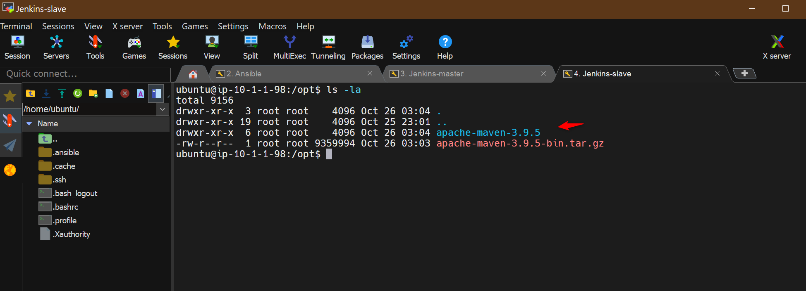
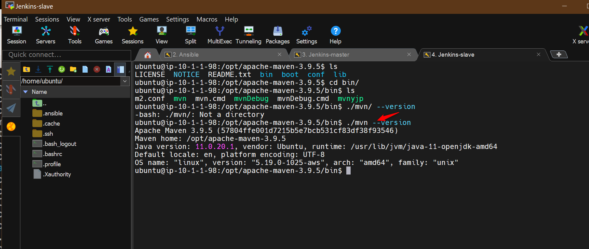

# Setup Ansible
1. Install ansibe on Ubuntu 22.04 
   ```sh 
   sudo apt update
   sudo apt install software-properties-common
   sudo add-apt-repository --yes --update ppa:ansible/ansible
   sudo apt install ansible
   ```

   


2. Add Jenkins master and slave as hosts 
Add jenkins master and slave private IPs in the inventory file 
in this case, we are using /opt is our working directory for Ansible. 
   ```
    [jenkins-master]
    18.209.18.194
    [jenkins-master:vars]
    ansible_user=ec2-user
    ansible_ssh_private_key_file=/opt/dpo.pem
    [jenkins-slave]
    54.224.107.148
    [jenkins-slave:vars]
    ansible_user=ec2-user
    ansible_ssh_private_key_file=/opt/dpo.pem
   ```


It needs to add jenkins master and jenkins slave machines as managed nodes into Ansible control


Need to copy the Private IP of those systems because public ip get changing when system restarts.

Create hosts file in ansible control

$vi hosts


Need to create a group of hosts
[jenkins-master]
10.1.1.122


Create jenkins-master variables for ansible to login


user - ubuntu
password: is a key file 


Successfully added


Test the connection

Copy the .pem file from windows to /opt folder in ansible server


Change permission to key file


Test the connection to jenkins master from ansible control

ansible all -i hosts -m ping

Connection successfull


Add Jenkins-slave to ansible control

[jenkins-slave]
10.1.1.98

copy private ip of jenkins -slave


Test the connection with jenkins-slave from ansible control


1. Test the connection  
   ```sh
   ansible -i hosts all -m ping 
   ```

Write ansible playbook to install jenkins

---
- hosts: jenkins-master
  become: true
  tasks:
  - name: add jenkins key
    apt_key:
      url: https://pkg.jenkins.io/debian-stable/jenkins.io-2023.key
      state: present

  - name: add jenkins repo 
    apt_repository: 
      repo: 'deb https://pkg.jenkins.io/debian-stable binary/'
      state: present 

  - name: install java 
    apt: 
      name: openjdk-11-jre
      state: present

  - name: install jenkins 
    apt: 
      name: jenkins 
      state: present       

  - name: start jenkins service 
    service: 
      name: jenkins 
      state: started 

  - name: enable jenkins to start at boot time 
    service: 
      name: jenkins 
      enabled: yes 

Login to Jenkins-master


jenkins is not yet installed


Copy Ansible playbook to Ansible control


Let's dry run 


LEt's run playbook to install jenkins


Ansible playbook ran successully and installed all packages for jenkins


Verify that jenkins is running


Access jenkins from browser UI

<public ip>:8080


Configure jenkins server


Jenkins accessed successfully


Write a playbook to set up jenkins-slave


Execute playbook to setup jenkins-slave

Login to jenkins-salve to chekc if maven file is present


Go to Ansible control and run playbook

Check it first


apache-maven installed successfully


apache maven uploaded to jenkin-slave





