# Setup Ansible
1. Install ansibe on Ubuntu 22.04 
   ```sh 
   sudo apt update
   sudo apt install software-properties-common
   sudo add-apt-repository --yes --update ppa:ansible/ansible
   sudo apt install ansible
   ```
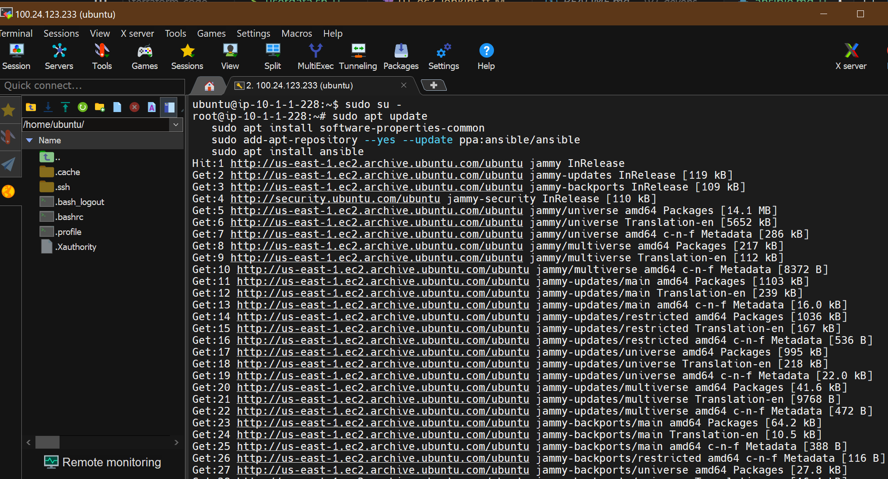
   


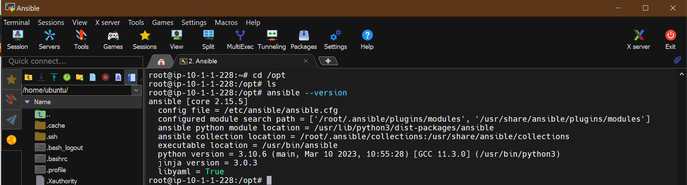


2. Add Jenkins master and slave as hosts 
Add jenkins master and slave private IPs in the inventory file 
in this case, we are using /opt is our working directory for Ansible. 
   ```
    [jenkins-master]
    18.209.18.194
    [jenkins-master:vars]
    ansible_user=ec2-user
    ansible_ssh_private_key_file=/opt/dpo.pem
    [jenkins-slave]
    54.224.107.148
    [jenkins-slave:vars]
    ansible_user=ec2-user
    ansible_ssh_private_key_file=/opt/dpo.pem
   ```
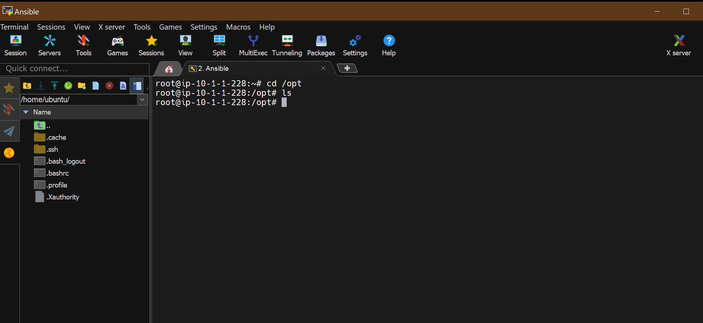

It needs to add jenkins master and jenkins slave machines as managed nodes into Ansible control
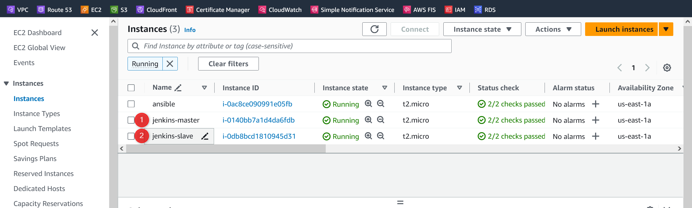

Need to copy the Private IP of those systems because public ip get changing when system restarts.

Create hosts file in ansible control

$vi hosts


Need to create a group of hosts
[jenkins-master]
10.1.1.122

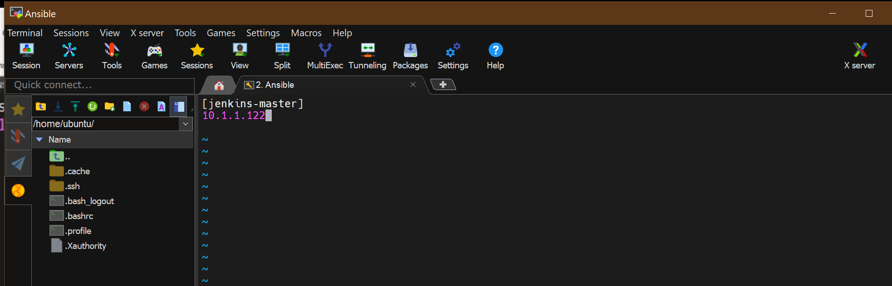

Create jenkins-master variables for ansible to login
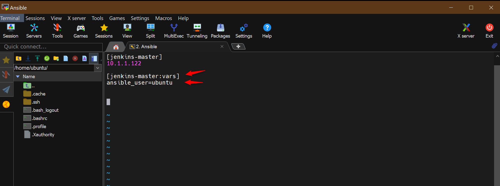

user - ubuntu
password: is a key file 

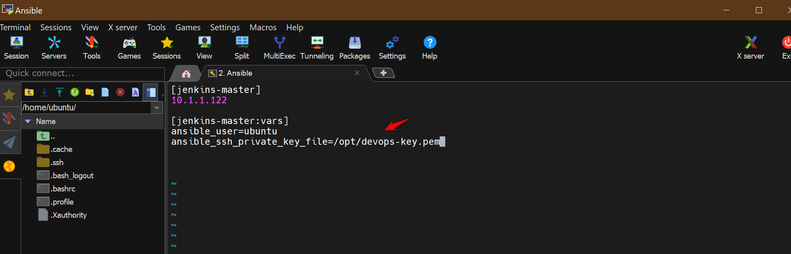

Successfully added
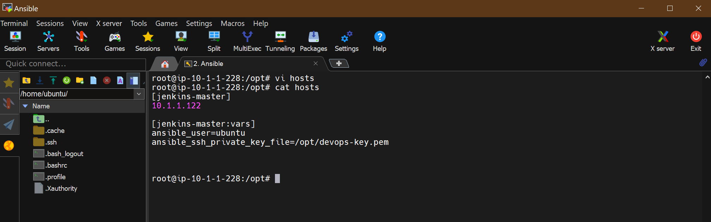

Test the connection

Copy the .pem file from windows to /opt folder in ansible server

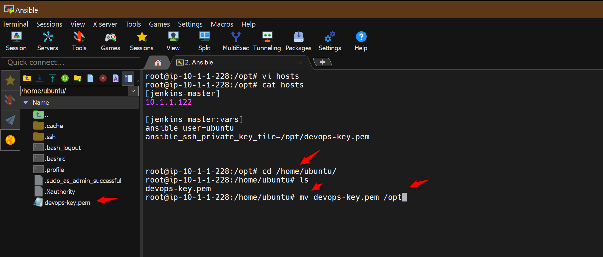

Change permission to key file
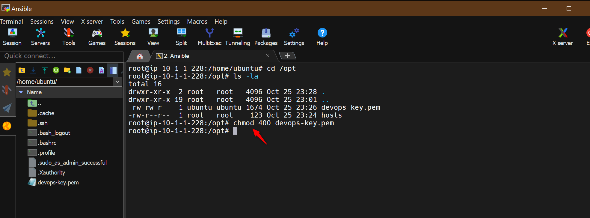

Test the connection to jenkins master from ansible control

ansible all -i hosts -m ping

Connection successfull

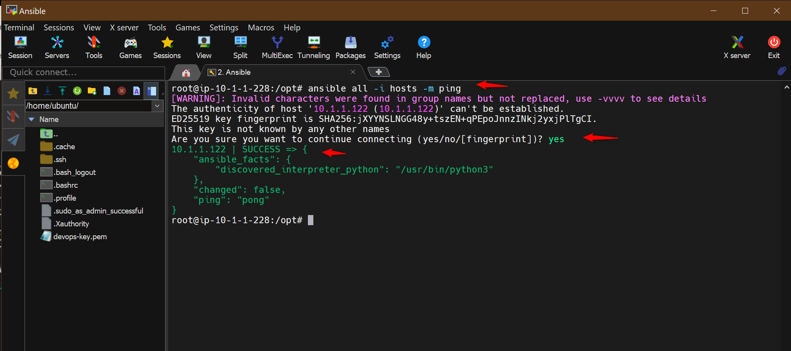

Add Jenkins-slave to ansible control

[jenkins-slave]
10.1.1.98

copy private ip of jenkins -slave


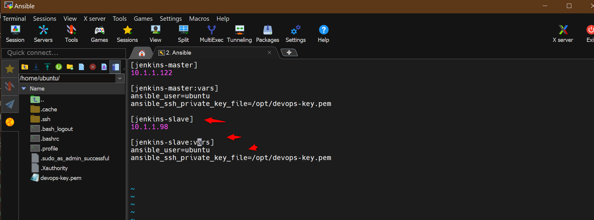

Test the connection with jenkins-slave from ansible control

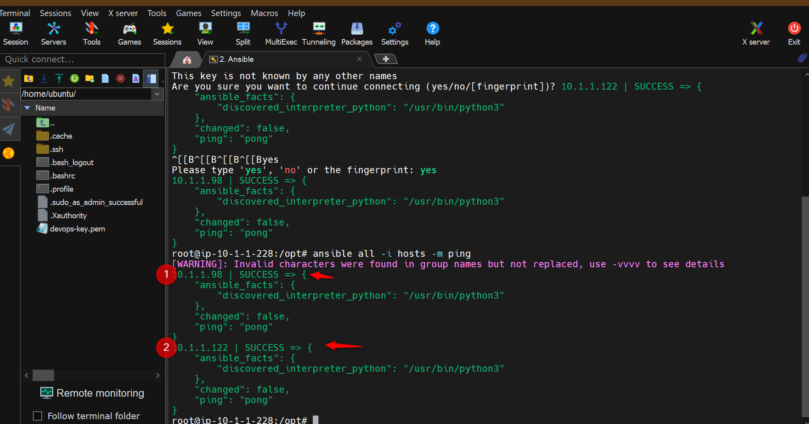


1. Test the connection  
   ```sh
   ansible -i hosts all -m ping 
   ```
