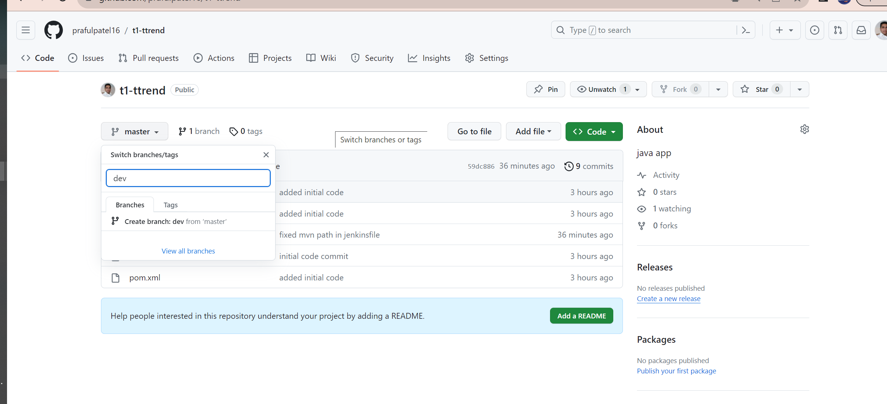
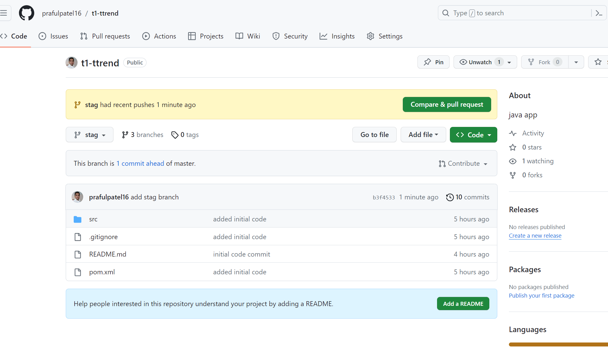

# Jenkins Master and Slave Setup

1. Add credentials 
2. Add node
   
### Add Credentials 
1. Manage Jenkins --> Manage Credentials --> System --> Global credentials --> Add credentials
2. Provide the below info to add credentials   
   kind: `ssh username with private key`  
   Scope: `Global`     
   ID: `maven_slave`    
   Username: `ec2-user`  
   private key: `devops-key.pem key content`  

View initial Jenkins password:
cat /var/lib/jenkins/secrets/initialAdminPassword

### Add node 
   Follow the below setups to add a new slave node to the jenkins 
1. Goto Manage Jenkins --> Manage nodes and clouds --> New node --> Permanent Agent    
2. Provide the below info to add the node   
   Number of executors: `3`   
   Remote root directory: `/home/ec2-user/jenkins`  
   Labels: `maven`  
   Usage: `Use this node as much as possible`  
   Launch method: `Launch agents via SSH`  
        Host: `<Private_IP_of_Slave>`  
        Credentials: `<Jenkins_Slave_Credentials>`     
        Host Key Verification Strategy: `Non verifying Verification Strategy`     
   Availability: `Keep this agent online as much as possible`  

Manage jenkins-master slave configuration

Add node

Agent is online

Verify from the jenkins-slave that remote jenkins file automatically copied to slave

/home/ubuntu/

Let's verify and test pipeline to check it's run on slave server

Create a test job on freestyle prpject

Build the job

Build success

Verify in the location to slave server

/home/ubuntu/jenkins/workspace/test-job

Let's write a jenkins pipeline

# Create Jenkinsfile into sourcecode web app

pipeline {
    agent {
        node {
            label 'maven-slave'
        }
    }

    stages {
        stage('clone-code') {
            steps {
                git branch: 'main', url: 'https://github.com/prafulpatel16/t1-ttrend.git'
            }
        }
    }
}

push file to remote sourcecod repo

Generate a new token in GitHUB

Token generated:

# Adding a GitHUB token to JENKINS

Go to Manage Jenkins > Credentials > System > Global Crednetials
Add Credentials

Go to Pipeline "ttrend-job" > Configure > Credentials

# Create Pipeline script from SCM

# CReate multibranch pipeline

Create a new brnach "dev"

# Create a new branches
Create a 'dev' brnach with same code
Creae a 'stag' branch and remove jenkinsfile from the source code of that branch

# Copy JEnkinsfile to 'stag' branch

Push jenkinsfile to remote stag branch

# Verify in Jenkins dashboard that all 3 brnaches as scanned and displayed there

# Setup GitHub Webhook

# Enable Webhook
1. Install "multibranch scan webhook trigger" plugin  
    From dashboard --> manage jenkins --> manage plugins --> Available Plugins  
    Search for "Multibranch Scan webhook Trigger" plugin and install it. 

2. Go to multibranch pipeline job
     job --> configure --> Scan Multibranch Pipeline Triggers --> Scan Multibranch Pipeline Triggers  --> Scan by webhook   
     Trigger token: `<token_name>`

JENKINS_URL/multibranch-webhook-trigger/invoke?token=[Trigger token] 
http://3.239.237.56:8080/multibranch-webhook-trigger/invoke?token=devops-token

3. Add webhook to GitHub repository
   Github repo --> settings --> webhooks --> Add webhook  
   Payload URl: `<jenkins_IP>:8080/multibranch-webhook-trigger/invoke?token=<token_name>`  
   Content type: `application/json`  
   Which event would you like to trigger this webhook: `just the push event` 

Once it is enabled make changes to source to trigger the build. 

http://3.239.237.56:8080/multibranch-webhook-trigger/invoke?token=devops-token

Commit changes to master branch and see the pipline is trigers from webhook itself

Master pipeline triggered

Commited changes triggered through webhook to jenkins master branch

